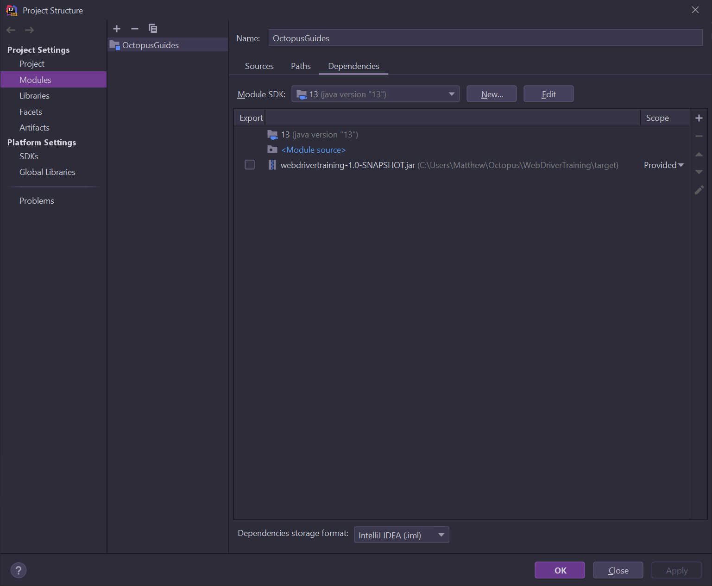

This repository contains the scripts used to generate the media for the Octopus guides. The blog at 
https://octopus.com/blog/devops-documentation explains the process.

See the [aspnet-azuredevops-artifactory-feed-azurewebsite-tfvc-video.yml](https://github.com/OctopusDeploy/OctopusGuides/blob/master/.github/workflows/aspnet-azuredevops-artifactory-feed-azurewebsite-tfvc-video.yml) 
file for a commented example.

The provisioning process can also be performed as a Vagrant script processor step to allow the resulting configuration
to be captured in a virtual machine. The `Vagrantfile` files under the [vagrant](https://github.com/OctopusDeploy/OctopusGuides/tree/master/vagrant) 
directory provide the necessary configuration to build the virtual machines, with the scripts in the 
[vm](https://github.com/OctopusDeploy/OctopusGuides/tree/master/vm) directory running through much the same process as 
the YAML files perform in GitHub Actions. 

To write the scripts in IntelliJ, reference the JAR file created by the project at https://github.com/OctopusDeploy/WebDriverTraining. 
IntelliJ can extract the Cucumber step definitions and use them to validate the feature files. 

 